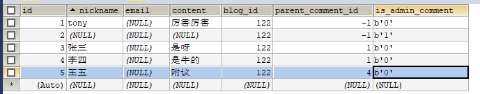

yaml配置文件
1. application.yaml
```yaml


spring:
  servlet:
    multipart:
      enabled: true
      #允许上传的单个文件大小
      max-file-size: 1GB
      #每次上传请求允许的文件总大小
      max-request-size: 6GB
  mail:
    username: ...
    password: ...
    host: ...
    mail:
      properties:
        mail:
          smtl:
            ssl:
              enable: true


  profiles:
    active: dev
  mvc:
    pathmatch:
      matching-strategy: ant_path_matcher

mybatis-plus:
  type-aliases-package: com.tony.blog.pojo
  configuration:
    log-impl: org.apache.ibatis.logging.log4j2.Log4j2Impl
  mapper-locations: classpath:mappers/*Mapper.xml
```
2. application-dev.yaml
```yaml
server:
  port: 8511
logging:
  config: src\main\resources\logback.xml
  level:
    com.tony.blog: trace
spring:
  datasource:
    url: jdbc:mysql://localhost:3306/tonyblog?useUnicode=true&useSSL=false&characterEncoding=utf8&serverTimezone=Asia/Shanghai
    username: root
    password: 123
    driver-class-name: com.mysql.jdbc.Driver
    type: com.alibaba.druid.pool.DruidDataSource
    #Spring Boot 默认是不注入这些属性值的，需要自己绑定
    #druid 数据源专有配置
    initialSize: 5
    minIdle: 5
    maxActive: 20
    maxWait: 60000
    timeBetweenEvictionRunsMillis: 60000
    minEvictableIdleTimeMillis: 300000
    validationQuery: SELECT 1 FROM DUAL
    testWhileIdle: true
    testOnBorrow: false
    testOnReturn: false
    poolPreparedStatements: true
    #配置监控统计拦截的filters，stat:监控统计、log4j：日志记录、wall：防御sql注入
    #如果允许时报错  java.lang.ClassNotFoundException: org.apache.log4j.Priority
    #则导入 log4j 依赖即可，Maven 地址：https://mvnrepository.com/artifact/log4j/log4j
    filters: stat,wall,log4j
    maxPoolPreparedStatementPerConnectionSize: 20
    useGlobalDataSourceStat: true
    connectionProperties: druid.stat.mergeSql=true;druid.stat.slowSqlMillis=500
# windows
resourceHandlers:
  file:
    resource: /cloudDisk/file/**
    location: D:\\cloudDisk\\files\\
  markdown:
    resource: /cloudDisk/markdown/**
    location: D:\\cloudDisk\\markdown\\

# linux
#resourceHandlers:
#  file:
#    resource: /cloudDisk/file/**
#    location: /usr/cloudDisk/files/
#  markdown:
#    resource: /cloudDisk/markdown/**
#    location: /usr/cloudDisk/markdown/
```
管理员登录

博客管理

* 发布
* 修改
* 删除
* 查询

分类管理

* 新增分类
* 删除分类
* 修改分类
* 查询分类

标签管理

* 新增
* 修改
* 删除
* 查询


前端展示

首页

* 博客分页
* 展示top标签
* 展示top分类
* 最新博客推荐
* 博客详情

分类

* 展示所有分类
* 展示单个分类下博客列表
* 博客详情

标签

* 展示所有标签
* 单个标签对应博客列表
* 博客详情

归档

* 年度时间线查询博客
* 博客详情


# 数据库设计

## user表

```sql
CREATE TABLE `t_user` (
  `id` BIGINT(20) NOT NULL AUTO_INCREMENT,
  `avatar` VARCHAR(255) DEFAULT NULL,
  `create_time` DATETIME DEFAULT NULL,
  `email` VARCHAR(255) DEFAULT NULL,
  `nickname` VARCHAR(255) DEFAULT NULL,
  `password` VARCHAR(255) DEFAULT NULL,
  `update_time` DATETIME DEFAULT NULL,
  `username` VARCHAR(255) DEFAULT NULL,
  PRIMARY KEY (`id`) USING BTREE
) ENGINE=INNODB AUTO_INCREMENT=3 DEFAULT CHARSET=utf8 ROW_FORMAT=DYNAMIC;


```


## message表

```sql
CREATE TABLE `t_message` (
  `id` BIGINT(20) NOT NULL AUTO_INCREMENT,
  `nickname` VARCHAR(255) DEFAULT NULL,
  `email` VARCHAR(255) DEFAULT NULL,
  `content` VARCHAR(255) DEFAULT NULL,
  `create_time` DATETIME DEFAULT NULL,
  PRIMARY KEY (`id`) USING BTREE
) ENGINE=INNODB AUTO_INCREMENT=103 DEFAULT CHARSET=utf8 ROW_FORMAT=DYNAMIC;

```

* nickname 评论者名
* email 评论者邮箱
* content 内容
* create_time 评论时间


## pictures表

```sql
CREATE TABLE `pictures` (
  `id` BIGINT(20) UNSIGNED NOT NULL AUTO_INCREMENT,
  `realFileName` VARCHAR(256) NOT NULL COMMENT '图片名',
  `saveFileName` VARCHAR(256) NOT NULL COMMENT '图片在存在服务器硬盘上的名',
  `ext` VARCHAR(20) DEFAULT NULL COMMENT '扩展名',
  `dir` VARCHAR(100) NOT NULL COMMENT '存储目录',
  `size` FLOAT(11,1) DEFAULT NULL COMMENT '大小（字节）',
  `type` VARCHAR(20) NOT NULL COMMENT '类型',
  `uploadTime` DATETIME DEFAULT CURRENT_TIMESTAMP COMMENT '上传时间',
  `changeTime` DATETIME DEFAULT CURRENT_TIMESTAMP COMMENT '更改时间',
  `isRecycle` INT(1) DEFAULT '0' COMMENT '是否进回收站',
  `isPublic` INT(1) DEFAULT '0' COMMENT '是否分享',
  `downLoadTimes` INT(7) DEFAULT '0' COMMENT '下载次数',
  `isImg` INT(1) DEFAULT NULL COMMENT '是否是图片',
  `userId` BIGINT(20) NOT NULL COMMENT '用户id',
  `duration` VARCHAR(10) DEFAULT NULL COMMENT '视频时长',
  PRIMARY KEY (`id`),
  KEY `userId` (`userId`),
  CONSTRAINT `myfile_ibfk_1` FOREIGN KEY (`userId`) REFERENCES `t_user` (`id`) ON UPDATE CASCADE
) ENGINE=INNODB AUTO_INCREMENT=9719 DEFAULT CHARSET=utf8
```


## 分类

```sql
CREATE TABLE `t_type` (
  `id` bigint(20) NOT NULL AUTO_INCREMENT,
  `name` varchar(255) NOT NULL,
  PRIMARY KEY (`id`) USING BTREE
) ENGINE=InnoDB AUTO_INCREMENT=59 DEFAULT CHARSET=utf8 ROW_FORMAT=DYNAMIC;

```


## 博客评论

```sql
CREATE TABLE `t_comment` (  
    `id` bigint(20) NOT NULL AUTO_INCREMENT,  
    `nickname` varchar(255) DEFAULT NULL,  
    `email` varchar(255) DEFAULT NULL,  
    `content` varchar(255) DEFAULT NULL,    
    `blog_id` bigint(20) DEFAULT NULL,  
    `parent_comment_id` bigint(20) DEFAULT NULL,  
    `is_admin_comment` bit(1) NOT NULL,  
    PRIMARY KEY (`id`) USING BTREE 
) ENGINE=InnoDB DEFAULT CHARSET=utf8 ROW_FORMAT=DYNAMIC
```

* blog_id 博客id
* parent_comment_id 父评论id
* is_admin_comment 是否是管理员评论
* content 评论内容
* email 邮箱


## 一篇博客

```sql
CREATE TABLE `t_blog` (
  `id` bigint(20) NOT NULL AUTO_INCREMENT,
  `appreciation` bit(1) NOT NULL,
  `commentabled` bit(1) NOT NULL,
  `content` longtext,
  `create_time` datetime DEFAULT NULL,
  `description` varchar(255) DEFAULT NULL,
  `first_picture` varchar(255) DEFAULT NULL,
  `flag` varchar(255) DEFAULT NULL,
  `published` bit(1) NOT NULL,
  `recommend` bit(1) NOT NULL,
  `share_statement` bit(1) NOT NULL,
  `title` varchar(255) DEFAULT NULL,
  `update_time` datetime DEFAULT NULL,
  `views` int(11) DEFAULT NULL,
  `type_id` bigint(20) DEFAULT NULL,
  `user_id` bigint(20) DEFAULT NULL,
  `comment_count` int(255) DEFAULT NULL,
  PRIMARY KEY (`id`) USING BTREE,
  KEY `FK292449gwg5yf7ocdlmswv9w4j` (`type_id`) USING BTREE,
  KEY `FK8ky5rrsxh01nkhctmo7d48p82` (`user_id`) USING BTREE,
  CONSTRAINT `FK292449gwg5yf7ocdlmswv9w4j` FOREIGN KEY (`type_id`) REFERENCES `t_type` (`id`),
  CONSTRAINT `FK8ky5rrsxh01nkhctmo7d48p82` FOREIGN KEY (`user_id`) REFERENCES `t_user` (`id`)
) ENGINE=InnoDB AUTO_INCREMENT=63 DEFAULT CHARSET=utf8 ROW_FORMAT=DYNAMIC;

```

* appreciation


# 评论功能




一条博客 id = 122

* id = 1当前是一条评论 parentCommentId = -1
    * id = 3当前是一条回复 parentCommentId = 1
    * id = 4当前是一条回复 parentCommentId = 1
    * id = 5当前是一条回复 parentCommentId = 4

```java
    @Autowired
    CommentMapper commentMapper;


    @Override
    public List<Comment> getComments(Long blogId) {
        // 查询所有评论
        // 指定blogId 及 parentCommentId 为-1
        QueryWrapper<Comment> wrapper = new QueryWrapper<>();
        wrapper.eq("blog_id", blogId);
        wrapper.eq("parent_comment_id", -1);
        List<Comment> comments = commentMapper.selectList(wrapper);
        // 递归获取评论
        for (Comment comment : comments) {
            List<Comment> replyComments = new ArrayList<>();
            getChildComment(comment, replyComments);
            comment.setReplyComments(replyComments);
        }
        return comments;
    }

    /**
     * 一对多回复
     * @param comment
     * @param replyComments
     */
    public void getChildComment(Comment comment, List<Comment> replyComments){
        // 根据当前的评论id，获取所有父评论指向当前的评论
        QueryWrapper<Comment> wrapper = new QueryWrapper<>();
        wrapper.eq("parent_comment_id", comment.getId());
        List<Comment> comments = commentMapper.selectList(wrapper);
        // 如果子评论为空，返回
        if (comments.size() == 0) return;
        // 否则，继续去找
        for (Comment co : comments) {
            replyComments.add(co);
            getChildComment(co, replyComments);
            co.setParentCommentId(comment.getId());
            co.setParentNickname(comment.getNickname());
        }
    }


    /**
     * 树形结构评论
     */
/*
    public List<Comment> getChildComment(Comment comment){
        // 根据当前的评论id，获取所有父评论指向当前的评论
        QueryWrapper<Comment> wrapper = new QueryWrapper<>();
        wrapper.eq("parent_comment_id", comment.getId());
        List<Comment> comments = commentMapper.selectList(wrapper);
        // 如果子评论为空，返回
        if (comments.size() == 0) return null;
        // 否则，继续去找
        for (Comment co : comments) {
            List<Comment> childComment = getChildComment(co);
            co.setReplyComments(childComment);
            co.setParentCommentId(comment.getId());
            co.setParentNickname(comment.getNickname());
        }
        return comments;
    }*/
```


## 增加一评论

需参数：

* nickName
* email
* content
* blogId
* parentCommentId